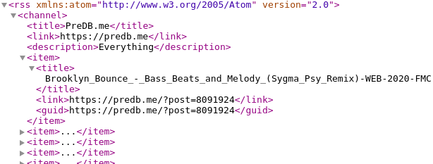

# PredB.me RSS feed Parser

[](https://travis-ci.org/luckylittle/predb_me_rss_parser)
[](https://github.com/luckylittle/predb_me_rss_parser/blob/master/LICENSE)
[](https://github.com/luckylittle/predb_me_rss_parser/releases)
[](https://goreportcard.com/report/github.com/luckylittle/predb_me_rss_parser)


[Golang](https://golang.org/) implementation of the [RSS feed](https://en.wikipedia.org/wiki/RSS) parser explicitly for the [PreDB.me](https://predb.me/) website (uses minimal Atom 2.0 feed type without pub date).

## Technical details

1. HTTP GET https://predb.me/?rss=1

An example:



2. Transform `<rss xmlns:atom="http://www.w3.org/2005/Atom" version="2.0"> ... </rss>` into XML struct:
   - 1x top item `<channel> ... </channel>` contains
   - 40x nested `<item> ... </item>` items which each contain
   - 1x `<title> ... </title>` for each item

3. Create a list of the 40 titles, while caching the information of the latest title (first `<title>` is the latest)

4. Run steps 1.-3. every `X` minutes

## Example of Usage

- Send daily summary of all CZ/CZECH releases via e-mail:

- `crontab -e`:

```text
MAILTO=""
# Get releases every 2 minutes
*/2 * * * * /home/lmaly/predb | grep -i "\.CZ\.\|czech\|\-CZ\-" >> predb_cz```

- `cat /etc/cron.daily/predb`:

```bash
#!/bin/bash

# Variables
PREDB_CZ=$(cat /home/lmaly/predb_cz | sort | uniq)
MAILTO_USER=lmaly
TODAY=$(date -u)

# Main function
if [ -z "$PREDB_CZ" ]
then
  echo "PREDB_CZ is empty!"
else
  echo -e "FROM: ${MAILTO_USER}\nTO: ${MAILTO_USER}\nSubject: Predb.me matches for ${TODAY}\n\n${PREDB_CZ}" | sendmail -t
fi

# Cleanup
cat /dev/null > /home/lmaly/predb_cz
```

## Note:

Unfortunately not all international releases will make it to the main RSS feed. To search specificly for a language section, this feed should be used: https://predb.me/?rss=1&language=czech (or search query https://predb.me/?search=czech&rss=1).

As an alternative/backup, similar RSS feeds exist - https://predb.ovh/api/v1/rss. Same URL has HTTP REST API for searching: https://predb.ovh/api/v1/?q=foobar.

---

_Last update: Fri May 8 00:08:42 UTC 2020_
